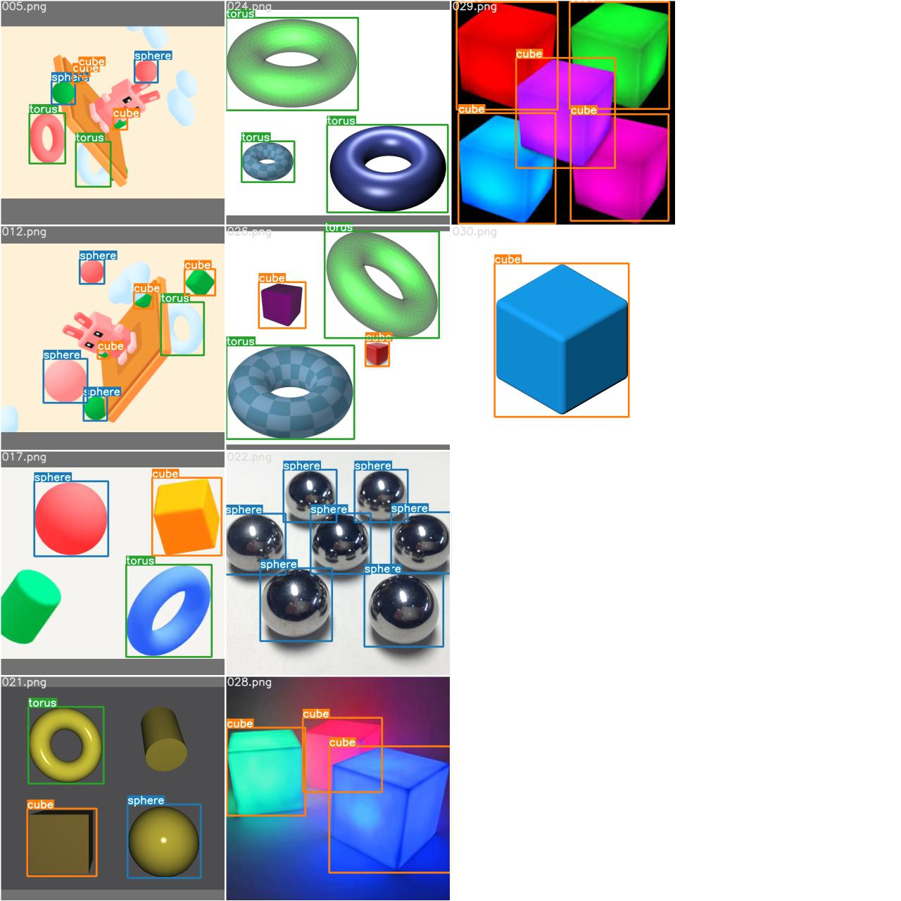
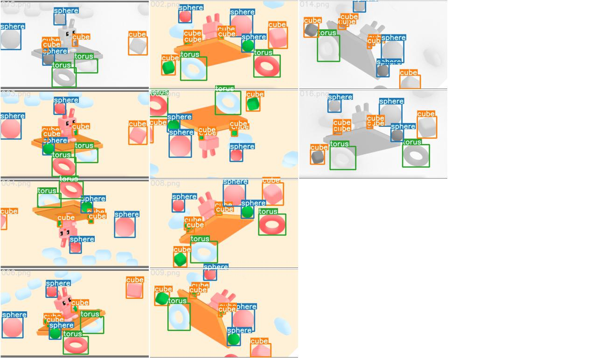
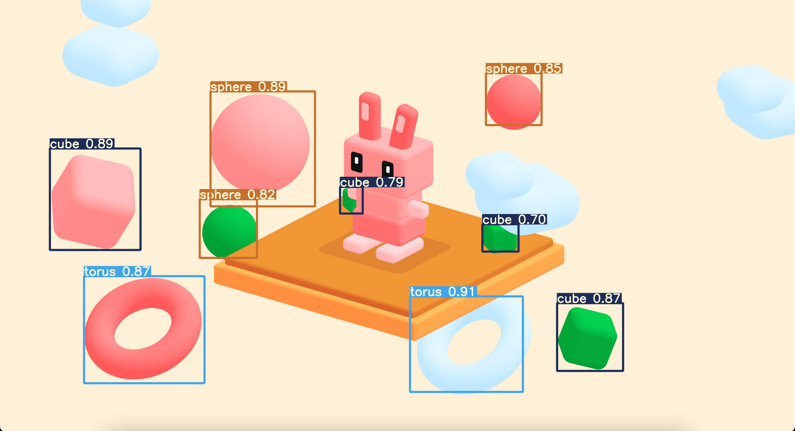
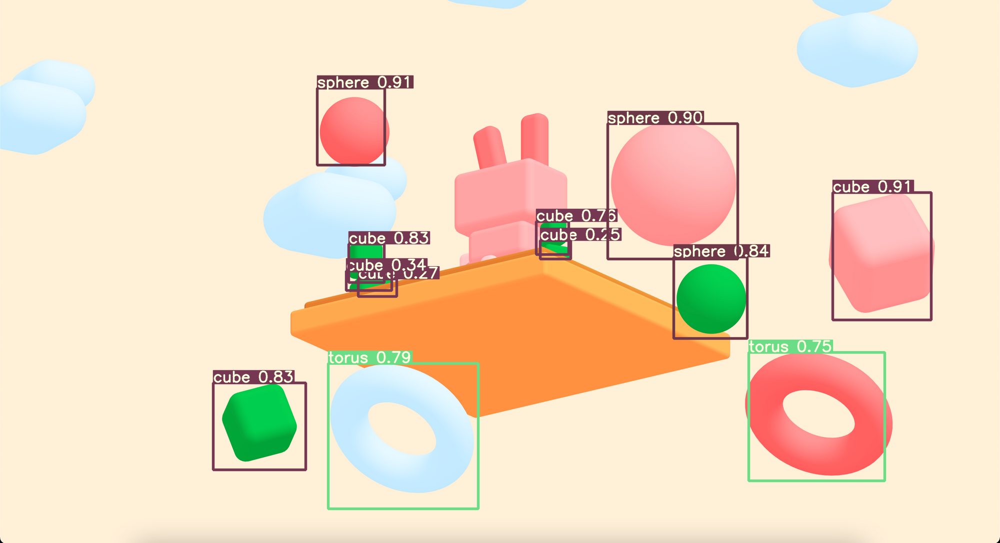
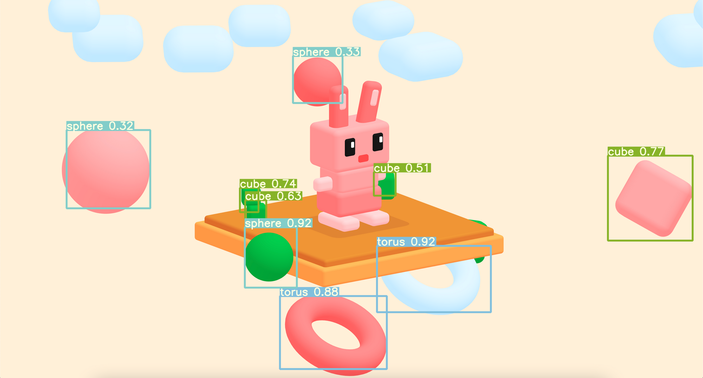
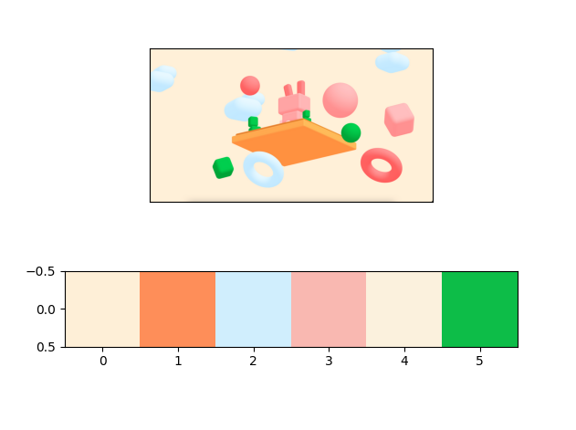

<a href="https://apps.apple.com/app/id1452689527" target="_blank">
</a>
&nbsp

## Three class object detection
We use a pretrained YOLO-tiny (8.9M params) since the task is relatively simple

## The database
We build a small database consisting of 30 images. We use the three images provided in the [Test-Spline](https://www.notion.so/Spline-ML-Test-56d8171c1e1044b0aaca3d4a24a75fbe), we applied data augmentation such us rotations and color distortion, then we get 16 images. The other 14 images were obtained from the internet. Here some examples.

 

The dataset was builded using the [Computer Vision Anotation](https://github.com/openvinotoolkit/cvat).

## Get the project 
```bash
$ git clone https://github.com/erickTornero/yolov3.git  # archive branch
```

## Install the Requirements

Python 3.8 or later with all [requirements.txt](https://github.com/ultralytics/yolov3/blob/master/requirements.txt) dependencies installed, including `torch>=1.7`. To install run:
```bash
$ pip install -r requirements.txt
```

## Inference

detect.py runs inference, our model was trained in the YOLOv3-tiny version. The weights of the network are stored in `last10.pt`. So, make sure you pass it as argument, check the following example. Results are saved in `runs/detect`.

```bash
$ python detect.py --view-img --weights last10.pt --source spline_test/spline1.png
```
Here some results





## Detect all 6 main colors

Many approaches to get the main colours use clousterization such us [ColorThief](https://pypi.org/project/colorthief/). in `principal_colors.py` file you can find an implementation of K-means to get the principal colours.

